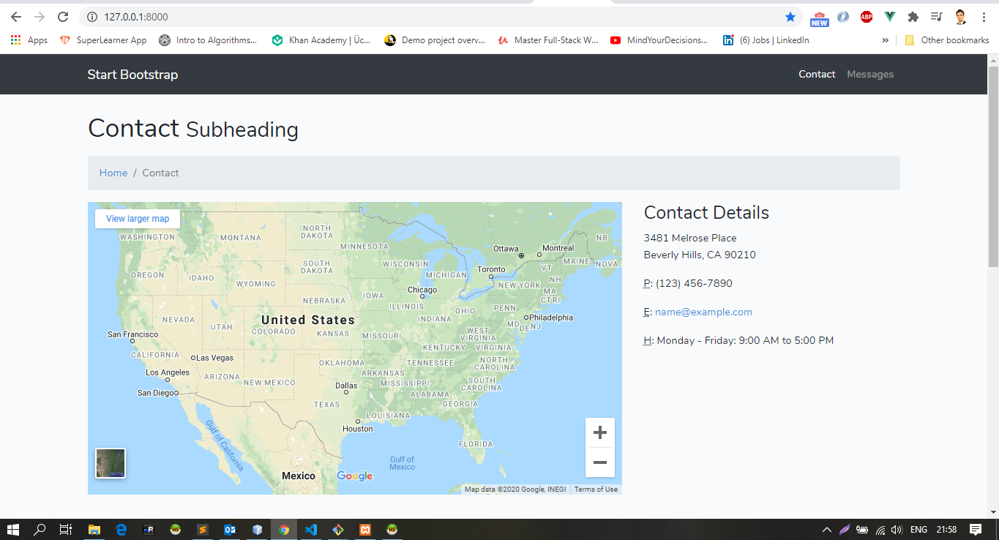
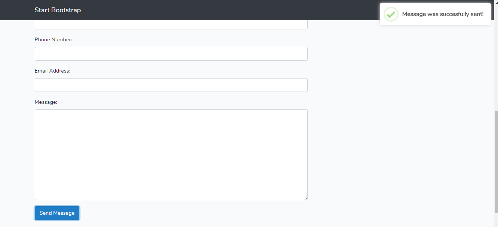
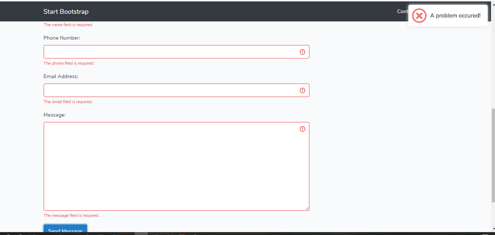
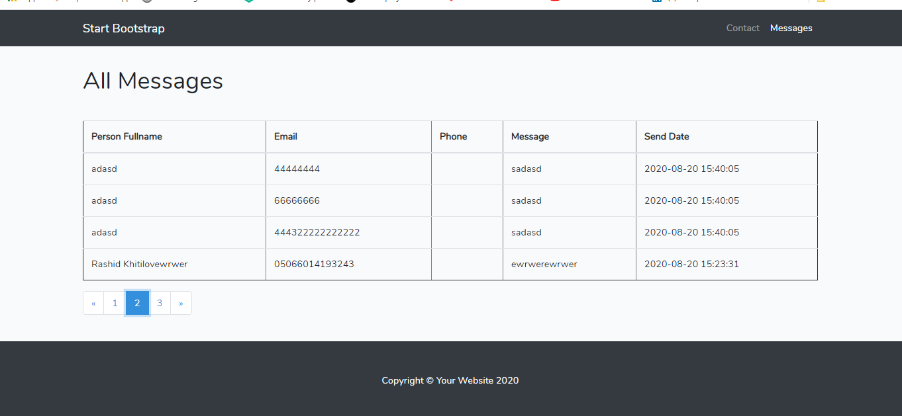

## Installation

1. clone the repo and cd into it
2. composer install
3. rename or copy .env.example file to .env
4. Enter your database credentials in your .env file
5. php artisan migrate
6. php artisan key:generate
7. npm install
8. npm run dev
9. php artisan serve
10. Visit localhost:8000 in your browser
11. db file: qscepter.sql

* Contact

* success

* error

*All Messages

